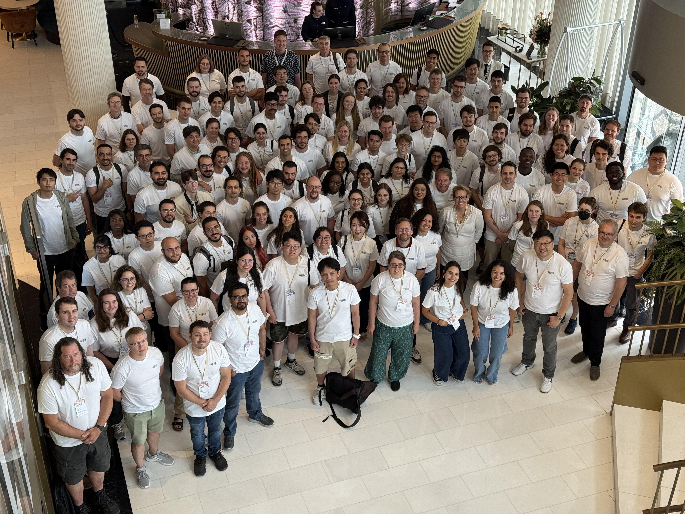

     
## What is the IHPCSS?
. . .
  * The International High Performance Computing Summer School is an
    in-person, one-week, intensive training event held in June or July
    in different locations in the world since 2010.
    . . .
  * International partners like XSEDE (US), PRACE (EU) and RIKEN (Japan)
    select students with the potential to use and advance HPC in their
    respective fields.
    . . .
  * They pay for those students to attend, and also
    provide and fund instructors and staff.
    . . .
  * The event contains a unique mentoring component to help students
    navigate their careers in HPC.
    . . .
  * Compute Canada was a partner from 2014 until 2017, and SciNet from
    2018 till 2023, and the Alliance from 2025 onwards.

## Alliance Pilot Project

Tania?

## NTCC IHPCSS Working Group

. . .
\vspace{-3mm}

  * Being a partner involves:
      - attending the international organization committee meetings
      - being part of the program development
      - running the selection process for Canadian applications
      - inviting selected students, and
      - supporting them at the event.
    . . .
  * The Alliance delegated these to the National Training Coordination Council (NTCC).
    . . .
  * The Alliance requires a proposal for the event's funding, which
    the WG wrote.    
    (It helps that the Alliance Training Coordinator is part of the WG).
    . . .
  * Finance and conditions on expenses were, handled by the Alliance in
    2025, by SciNet in 2026.
    . . .
  * The latter required another proposal from SciNet to the Alliance.
  

## IHPCSS 2025: Lisbon, Portugal

[[

||

******<https://ss25.ihpcss.org>******
. . .

  * Canadian students applied: **137**
    . . .
  * Canadian students selected: **10**
    . . .
  * Returning mentor: **1**
    . . .
  * Instructors sent:    
    Yohai Meiron, James Willis, and Ramses van Zon (paid by SciNet)
    . . .
  * IHPCSS Working group:    
    Sarah Huber, Moïra Dion, Ramses van Zon, and Catherine Di Vita

]]
. . .
\small
* Reviewers: Sarah Huber, Moïra Dion, Yohai Meiron, Alex Razoumov, James Willis, Sarah Cameron-Pesant, Bruno Mundim, Vladimir Slavnic, Marco Saldarriaga, Chris Want, Jerry Li, Matthew Smith, Paul Preney, Chris Loken, Jane Fry 

.

## IHPCSS 2026: Perth, Australia

[[

.
.

||

******<https://ss26.ihpcss.org>******
. . .

  * Canadian students applied: **232**
    . . .
  * Canadian students selected: **10**
    . . .
  * Returning mentor: **1**
    . . .
  * Instructors to be sent:    
    Sarah Huber, Alex Razoumov, Ramses van Zon
    . . .
  * IHPCSS Working group:    
    Sarah Huber, Julie Faure-Lacroix, Ramses van Zon, and Tania Tan

]]

. . .
\small
* Reviewers: Yohai Meiron, Alex Razoumov, James Willis,
Bruno Mundim, Vladimir Slavnic, Marco Saldarriaga,
Chris Want, Jerry Li, Matthew Smith, Gurpreet Matharoo
Chris Loken, Olivier Fisette, Ross Dickson, Patrick Mann

.

## Evolving content

  * The main focus is and remains large scale HPC.
    . . .
  * The technical content is reviewed every year.
    . . .
  * The IHPCSS has changed significantly since the School was first run in 2010:
    . . .
      - GPU programming has become a standard component.
      - The big data/machine learning/AI component is growing.
      - There's even an Python for HPC session.
      - But, on purpose, it will not become an AI conference.
      - The mentoring component is unique and well-established.
    . . .
  * Every year much effort is put into collecting feedback,
    understanding the skill landscape and adjusting the technical
    content.

. . .

\small

Scott Callaghan et al. 2025. Fifteen Years of International HPC
Summer School. In PEARC '25, ACM, New York, NY, USA, Article 17,
1–8. ****<https://doi.org/10.1145/3708035.3736011>****

## Lessons Learned
. . .
  * Budget needs fairly large margins to account for rising costs and
    unknown origins of participants.
    . . .
  * VISAs are always an uncertain issue; in 2025, two students could not
    make it because of delays in VISA appointments.
    . . .
  * The working group only needs to meet frequently in specific periods.
    . . .
  * We need more reviewers (or advertise less...).
    . . .
  * Coordinating the finances between two organizations is painful and
    slow; best try to avoid.

. . .

###

  * But it is worth it, there is a lot of demand.
    . . .
  * Hoping for a multi-year training strategy that includes this event!    
    (so we may bring it to Canada?)
